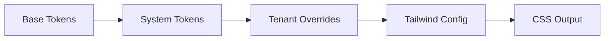

# Tenant Site Architecture

**Version**: 0.1  
**Last Updated**: {{current_date}}  
**Inspired By**: Hugo (content modeling), Shopify (e-commerce), Atomic Design (component structure), Tailwind/DaisyUI (styling)

## Table of Contents
1. [Core Principles](#core-principles)
2. [Directory Structure](#directory-structure)
3. [Design Systems](#design-systems)
4. [Component Architecture](#component-architecture)
5. [Styling System](#styling-system)
6. [Template Resolution](#template-resolution)
7. [Build Process](#build-process)
8. [Multi-Tenant Considerations](#multi-tenant-considerations)

---

## Core Principles

1. **Atomic Design Hierarchy**:
   - Atoms → Molecules → Organisms → Templates → Pages
   - Strict isolation between layers

2. **Design Token Driven**:
   - All styling flows from centralized tokens
   - Tokens compile to Tailwind/DaisyUI format

3. **Progressive Overrides**:
   ```mermaid
   graph TD
     A[Base System] --> B[Design System]
     B --> C[Tenant Overrides]
     C --> D[Page-Specific]
   ```

4. **Zero-Runtime CSS**:
   - All styles compiled at build time
   - DaisyUI components rendered to static HTML

---

## Directory Structure

```
tenants/
├── {{tenant-id}}/
│   ├── config.yaml          # Tenant configuration
│   ├── content/             # Markdown/structured content
│   ├── data/                # Tenant-specific data files
│   └── design/
│       ├── partials/      # Tenant-specific component overrides
│       ├── layouts/         # Custom page layouts
│       └── tokens.json      # Design token overrides
│
design/
├── systems/
│   ├── base/                # Mandatory base system
│   │   ├── atoms/
│   │   ├── molecules/
│   │   ├── organisms/
│   │   ├── tokens/
│   │   │   ├── colors.json
│   │   │   └── spacing.json
│   │   └── system.yaml
│   │
│   └── retail/             # Example specialized system
│       └── (same structure)
│
├── templates/              # Global template definitions
└── utilities/              # Tailwind plugins, custom utilities
```

---

## Design Systems

### Base System (Required)
```yaml
# design/systems/base/system.yaml
name: Base
version: 1.0.0
requires:
  - tailwind@3.3.0
  - daisyui@5.0.0
components:
  atoms:
    - Button
    - Icon
    - Badge
  molecules:
    - Card
    - FormInput
```

### Tenant Configuration
```yaml
# tenants/{{tenant-id}}/config.yaml
design:
  system: retail
  additional_systems:
    - marketing
  tokens:
    primary: "#3b82f6"
    secondary: "#10b981"
```

---

## Component Architecture

### Atomic Structure
| Level       | Example Components          | Tailwind Class Usage |
|-------------|-----------------------------|----------------------|
| **Atoms**   | Button, Input, Badge        | Utility classes only |
| **Molecules**| Card, FormGroup, Alert      | Composed atoms       |
| **Organisms**| Header, ProductGrid         | Composed molecules   |

### Example Component (Atom)
```html
<!-- design/systems/base/atoms/Button.html -->
<button 
  class="btn btn-{{ .variant | default "primary" }} 
         {{ with .size }}btn-{{ . }}{{ end }}"
  {{ with .disabled }}disabled{{ end }}>
  {{ .children }}
</button>
```

---

## Styling System

### Token Processing Pipeline


### Example Token Definition
```json
{
  "color": {
    "primary": {
      "base": "#3b82f6",
      "light": "#93c5fd",
      "dark": "#1d4ed8"
    }
  },
  "spacing": {
    "base": "1rem",
    "sm": "0.5rem"
  }
}
```

---

## Template Resolution

1. **Component Lookup Order**:
   ```go
   []string{
       "tenants/{{tenant}}/design/{{component-path}}",
       "design/systems/{{active-system}}/{{component-path}}",
       "design/systems/base/{{component-path}}",
   }
   ```

2. **Layout Resolution**:
   ```go
   []string{
       "tenants/{{tenant}}/design/layouts/{{layout-name}}",
       "design/systems/{{active-system}}/layouts/{{layout-name}}",
       "design/templates/{{layout-name}}",
   }
   ```

---

## Build Process

```bash
# Compile steps:
1. Load tenant config
2. Resolve design tokens
3. Generate Tailwind config
4. Build CSS assets
5. Render components → HTML
6. Hydrate with Alpine.js (optional)
```

---

## Multi-Tenant Considerations

1. **Isolation**:
   - Each tenant gets separate:
     - Content tree
     - Asset pipeline
     - Output directory

2. **Shared Resources**:
   - Design systems are immutable at runtime
   - Compiled CSS is tenant-specific

3. **Performance**:
   - Parallel builds per tenant
   - Shared cache for common assets

---

**Appendix**:  
[Example Component Library](./EXAMPLES.md)  
[Token Specification](./TOKENS_SPEC.md)  
[Build Configuration](./BUILD_CONFIG.md)